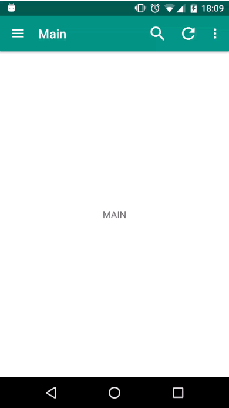

#Demo App for [Ti.DrawerLayout](https://github.com/manumaticx/Ti.DrawerLayout)

This is a demo application for showing how to use [https://github.com/manumaticx/Ti.DrawerLayout](https://github.com/manumaticx/Ti.DrawerLayout)

It shows how to use the drawer for navigation. The left view of the drawer layout works as a menu that lets you switch between top-level views. Each content view is represented as an element in the menu.

~~Every content view is a separate controller which can have its own ActionBar setup and optionsMenu. We also want to achieve to add a consistent Overflow menu with standard action items like Help and Settings, according to the [Android Design Guidelines](http://developer.android.com/design/patterns/navigation-drawer.html) (Notice how the overflow menu stays visible as the Drawer layout expands while the contextual action items gets removed from the action bar).~~
*EDIT: Since the NavigationDrawer overlaps the Toolbar according to the new Material Deisgn Guide the options menu is not accessible anymore when the Drawer is open.*

Opening and closing the controllers for the content view is done by a global open method in `alloy.js`. It expects each controller to have an public `init` and `cleanup` method. That way we can keep it clean and responsive.

Additionally, this demo shows you how to handle the native back button with a custom backstack implementation. Therefor, each controller that is opened with the global open method is added to a backstack array (actually only the id, not the controller itself - so don't worry, this is memory friendly). You can select another view in the drawer menu and use the native back button to go back to the previous one without keeping it in memory.

### Limitations

I tried to make the drawer menu accessible from deeper-level views such as from a second window (e.g. detail window). You can't just add the global drawer reference to this. One workaround could be adding a new drawer instance with the same menu controller in it but this could become dangerous and complex. In a native app you'd use fragments. It's also possible to use activities but I need to think about how this could be accomplished from the module.

### License

    The MIT License (MIT)

    Copyright (c) 2014 - 2016 Manuel Lehner

    Permission is hereby granted, free of charge, to any person obtaining a copy
    of this software and associated documentation files (the "Software"), to deal
    in the Software without restriction, including without limitation the rights
    to use, copy, modify, merge, publish, distribute, sublicense, and/or sell
    copies of the Software, and to permit persons to whom the Software is
    furnished to do so, subject to the following conditions:

    The above copyright notice and this permission notice shall be included in
    all copies or substantial portions of the Software.

    THE SOFTWARE IS PROVIDED "AS IS", WITHOUT WARRANTY OF ANY KIND, EXPRESS OR
    IMPLIED, INCLUDING BUT NOT LIMITED TO THE WARRANTIES OF MERCHANTABILITY,
    FITNESS FOR A PARTICULAR PURPOSE AND NONINFRINGEMENT. IN NO EVENT SHALL THE
    AUTHORS OR COPYRIGHT HOLDERS BE LIABLE FOR ANY CLAIM, DAMAGES OR OTHER
    LIABILITY, WHETHER IN AN ACTION OF CONTRACT, TORT OR OTHERWISE, ARISING FROM,
    OUT OF OR IN CONNECTION WITH THE SOFTWARE OR THE USE OR OTHER DEALINGS IN
    THE SOFTWARE.
# apps-based-on-demo-manu
